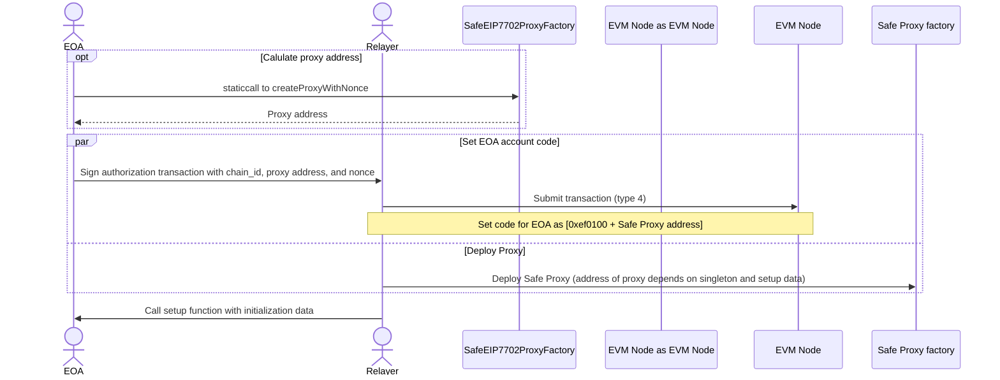

# safe-interoperable-delegated-account-poc
A POC for ERC-Interoperable Delegated Account

This repository showcases how EOA account can delegate to a Safe account. [ERC-7702](https://github.com/ethereum/EIPs/blob/master/EIPS/eip-7702.md) introduces a new transaction type 4 that allows EOA to set code and delegate to a contract.

- [SafeEIP7702.sol](./contracts/SafeEIP7702.sol) is a custom proxy contract that can be set up as a delegate for an EOA account. A custom proxy is required because with ERC-7702 it is not possible to execute initcode while giving authority to a contract. Having a custom proxy ensures that account storage can only be initialized with a pre-determined and approved initializer.


This proxy contract takes the hash of the setup data in the constructor, which means that the proxy address depends on the setup data. Thus, it is not possible to initialize the storage of an EOA with arbitrary data after the authorization transaction.

- [SafeEIP7702ProxyFactory.sol](./contracts/SafeEIP7702ProxyFactory.sol) is a factory contract that can be used to deploy the SafeEIP7702 proxy contract.

- [IDAFallbackHandler.sol](./contracts/IDAFallbackHandler.sol) is used as a fallback handler and module when an account has been delegated to a Safe proxy.

- [ClearAccountStorage.sol](./contracts/ClearSafeStorage.sol)

    An EOA account can delegate to this contract to clear account storage associated with a Safe contract. This contract can also be used to clear storage at specific slots using the `clearStorageSlots(bytes32[])` function. This function is useful when it is not possible to know which storage slots need to be cleared on-chain, e.g., mappings.

    Using this contract, the following storage slots associated with Safe can be cleared: 
    - clear slot 7 - `mapping(bytes32 => uint256) internal signedMessages;`
    - clear slot 8 - `mapping(address => mapping(bytes32 => uint256)) internal approvedHashes;`

__Note:__ This contract does not implement any verification logic.

## TODO

- Restore nonce after re-delegation back to SafeProxy
- Allow EOA delegating the authority to be an owner

## Install

```bash
    pnpm i
```

## Test

```bash
    npx hardhat test --deploy-fixture --network pectra
```

## Execute scripts

### Setup

1. Copy `.env.example` to `.env` and update the values 
2. Make sure the contracts are deployed on the network and `hardhat.config.ts` has appropriate values for the network.

### 1. Set code to Safe Proxy

```bash
    npx hardhat run src/scripts/1_set_code.ts --network pectra
```

### 2. Execute transaction
```bash
    npx hardhat run src/scripts/2_execute.ts --network pectra
```

### 3. Execute multi-send transaction
```bash
    npx hardhat run src/scripts/3_batch_execute.ts --network pectra
```

## Sequence Diagram



## Alternative approaches

1. **EOA Delegation to Safe Singleton**

    - EOA delegates to a Safe Singleton contract.
    - The Singleton has to be adapted for EIP-7702.
    - Pro: No need of proxy deployment and proxy factory.
    - Con: EOA has to sign the initialization data. Compared to the proxy approach, this is an additional step for the EOA to sign the initialization data.

2. **SafeLite**

    - See: [./contracts/experimental/SafeLite.sol](./contracts/experimental/SafeLite.sol)
    - A custom lite contract tailored for EIP-7702 which does not require any setup function.
    - By default EOA is the only owner.
    - Support batching transactions, smart contract signature verification (ERC-1271), ERC-4337.

### Useful links

- [Pectra Faucet](https://faucet.pectra-4.ethpandaops.io/)
- [Ithaca](https://app.conduit.xyz/published/view/odyssey)